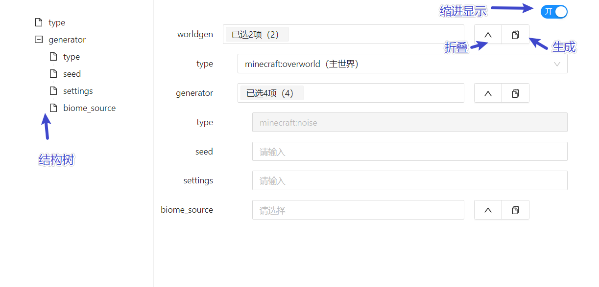
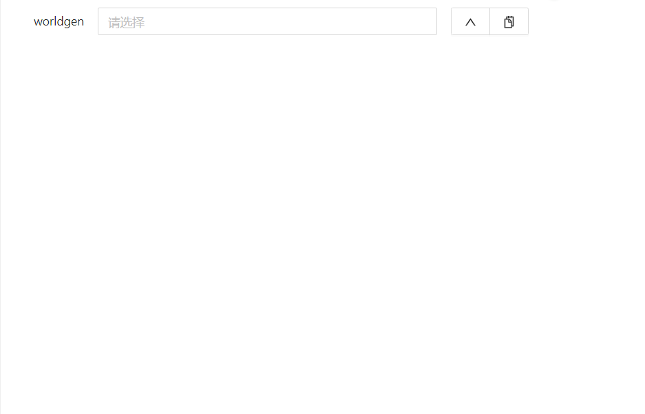
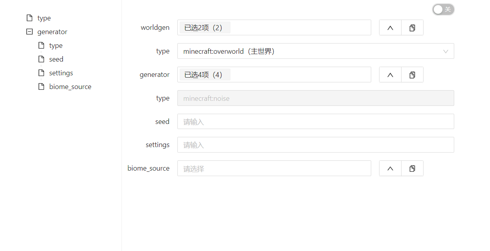
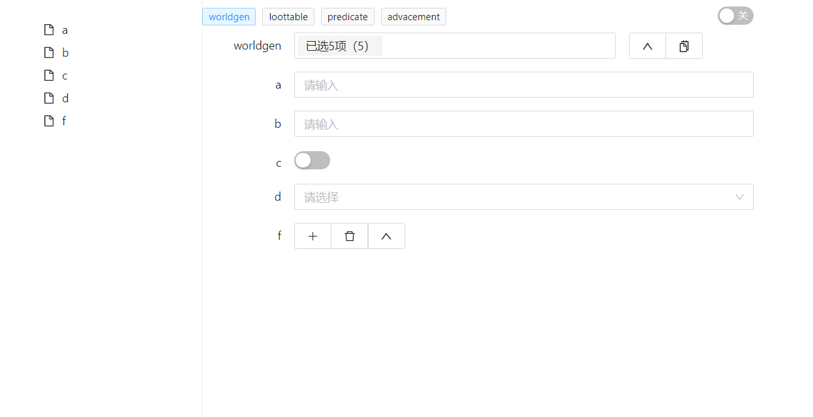

# minecraft schema example

## 简介

一些可用于描述minecraft数据包json文件并用于定义生成器结构的json文件（如：predicate，loottable）



## 接口规范

这里使用typscript语法描述，下面的接口定义了json中的数据结构

``` typescript
type NbtNumberType = 'byte' | 'int' | 'short' | 'double' | 'long' | 'float' | 'number'
type NbtBoolType = 'bool'
type NbtStringType = 'string'
type NbtListType = 'list'
type NbtEnumType = 'enum'
type NbtObjectType = 'object'
type NbtType = NbtNumberType | NbtBoolType | NbtStringType | NbtListType | NbtEnumType | NbtObjectType

interface GObject<T> { [propName: string]: T; }
interface ISelect { id: string; name: string; }

type NbtObject = GObject<NbtProps>

interface NbtComponent {
    base?: string[]; // 模板
    has?: string[] | boolean; // 初始化时已选择的项
    nbt?: NbtObject; // nbt定义
    root?: boolean; // 是否为根类型
}
interface NbtProps {
    type?: NbtType; // 类型
    enum?: string | ISelect; // 下拉框的枚举值
    subtype?: string | string[]; // 子类型
    default?: string | boolean | number; // 默认值
    title?: string; // 标题
    description?: string; // 备注
    disabled?: boolean; // 禁用
    
    link?: string[]; // 将来特性
    linkType?: string; // 将来特性
    minItems?: number; // 将来特性
    maxItems?: number; // 将来特性
    max?: number; // 将来特性
    min?: number; // 将来特性
}
```

## 举例

比如定义worldgen的schema，`root`是必须的有一个的，相当于入口，下面定义了所有支持的类型，基本涵盖了minecraft所有的情况。

类型包括：`string` `number` `bool` `enum` `object` `list`

其中object对应了minecraft中的Compound，list对应了list，因此，无论多嵌套多深都可以用此规则描述，甚至可以引用自身

``` json
{
    "worldgen": {
        "root": true,
        "nbt": {
            "a": {
                "type": "string"
            },
            "b": {
                "type": "number"
            },
            "c": {
                "type": "bool"
            },
            "d": {
                "type": "enum",
                "enum": [ "A", "B", "C" ]
            },
            "e": {
                "type": "object",
                "subtype": "worldgen"
            },
            "f": {
                "type": "list",
                "subtype": "string"
            }
        }
    }
}
```



但是minecraft中的json类型的配置并不想nbt，多数的时候都是比选项，所以提供了`has`属性来控制初始化时包含的字段，如果设置为`true`，就是默认勾选所有的字段，如果仅是部分字段必填，可以使用数组

```
has: true
// or
hans: ["a", "c"]
```

当然了，为了提高软件的稳定性和用户的体验，添加了`disabled` `default` `title` `description`等属性，开发者可以在合适的时机使用。

哦，还有就是左侧提供了结构树，右上角提供了缩进开关，以及鼠标移动到label高亮和备注展示等功能。



那么如果定义多个入口呢，比如定义lootable、worldgen、predicate、advancement共四个schema，也就是4个生成器结构。
`root`属性相当于入口，决定了有多少个

```
{
    "worldgen": {
        "root": true,
        "has": true,
        "nbt": {
            "a": {
                "type": "string"
            },
            "b": {
                "type": "number"
            },
            "c": {
                "type": "bool"
            },
            "d": {
                "type": "enum",
                "enum": [
                    "A",
                    "B",
                    "C"
                ]
            },
            "f": {
                "type": "list",
                "subtype": "string"
            }
        }
    },

    "loottable": {
        "root": true,
        "nbt": {
            "a": {
                "type": "bool"
            }
        }
    },
    "predicate": {
        "root": true,
        "nbt": {
            "a": {
                "type": "enum",
                "enum": [
                    "A",
                    "B",
                    "C"
                ]
            }
        }
    },
    "advacement": {
        "root": true,
        "nbt": {
            "a": {
                "type": "number"
            }
        }
    }
}
```




当然了，还有一些高阶的用法，算是语法糖了，例如下面是worldgen中的一段定义，使用此语法可以批量的定义，程序会自动解析生成，避免了繁琐的书写。

```json
"structure_structure": {
  "key": {
    "structure": [
      "jungle_pyramid",
      "village",
      "endcity",
      "ruined_portal",
      "igloo",
      "stronghold",
      "bastion_remnant",
      "desert_pyramid",
      "nether_fossil",
      "buried_treasure",
      "mansion",
      "shipwreck",
      "monument",
      "swamp_hut",
      "fortress",
      "pillager_outpost",
      "ocean_ruin",
      "mineshaft"
    ]
  },
  "nbt": {
    "${structure}": {
      "type": "object",
      "subtype": "base_structure",
      "description": "区块中两次这种结构的放置尝试的平均距离"
    }
  }
}
```

## 贡献

现在一切的一切都还在初级阶段，还有很多东西在完善，如果你恰好感兴趣，欢迎加入进来


- [minecraft-nbt-dic](https://github.com/hans000/minecraft-nbt-dic) 字典值，一般用于提供枚举值


